L'application Customer-front-thymeleaf :
On va utiliser 3 providers pour la sécurité: google, github et keycloack
<ul>
    <li>Google</li>
On va cree un client google et on recupère son id et son secret :

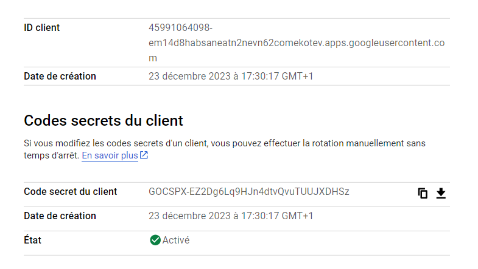
Alors, apres avoir configurer le provider google, il faut d'abord se connecter en utilisant un compte gmail
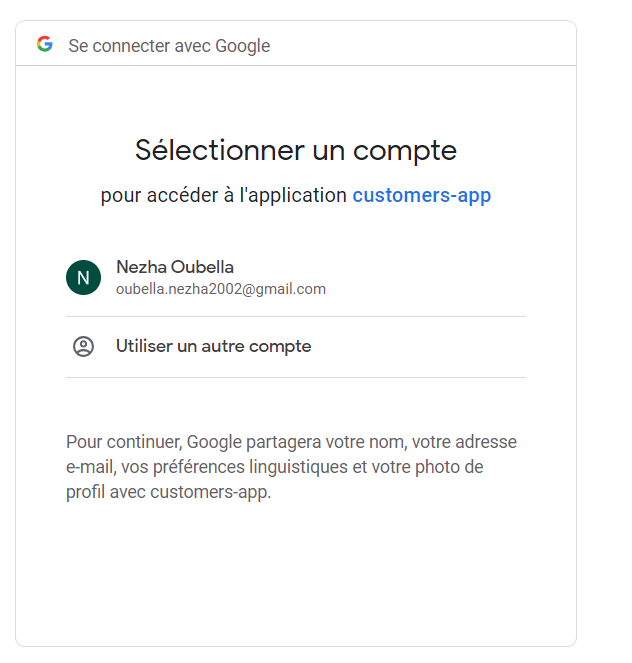

<li>Github</li>
On va cree un client github et on recupère son id et son secret :

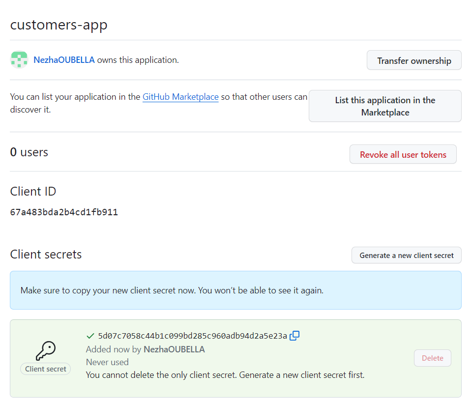

Alors il faut d'abbord choisi github :

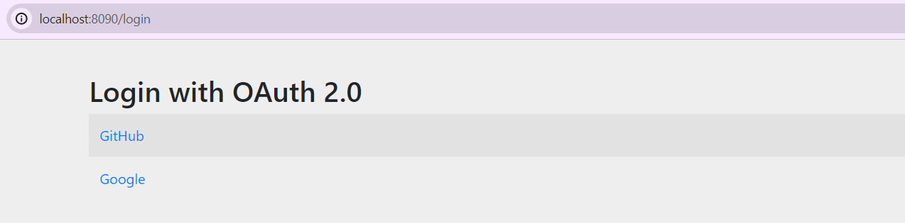
Puis autoriser l'application :

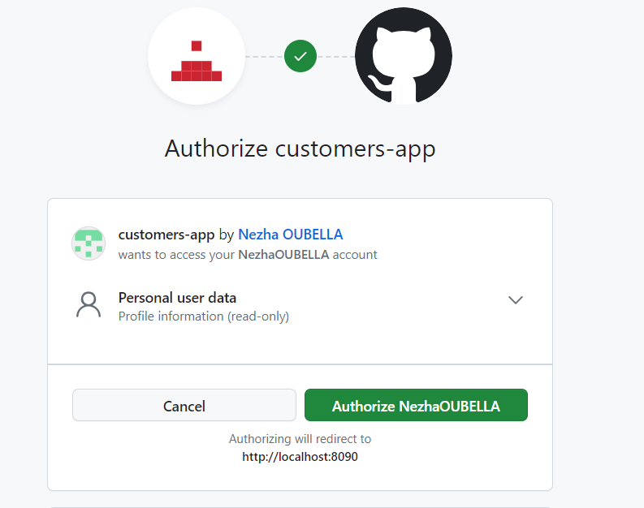

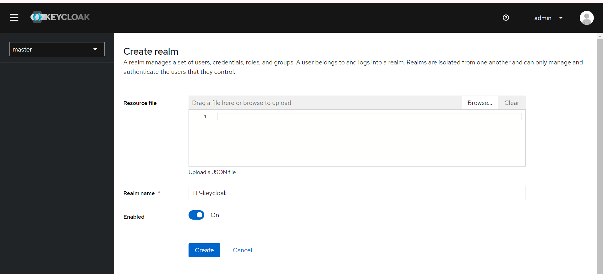

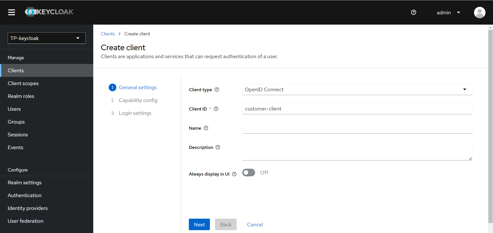

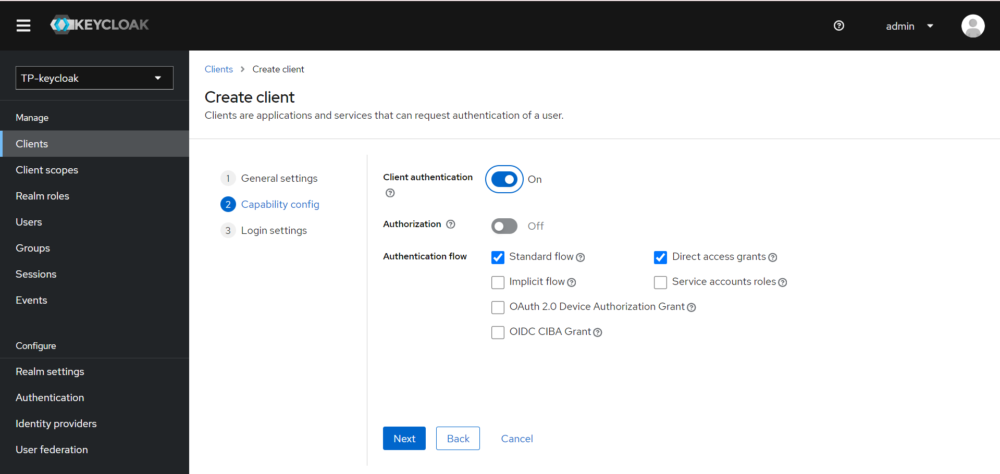

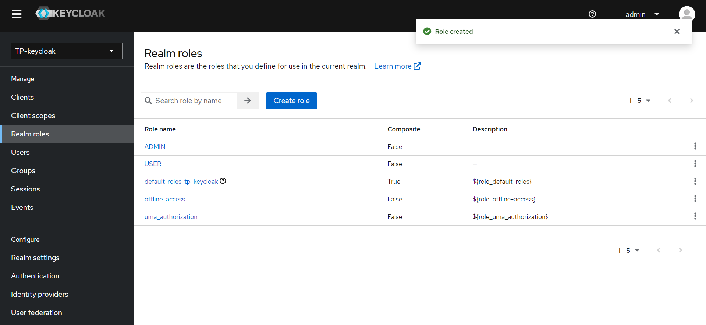

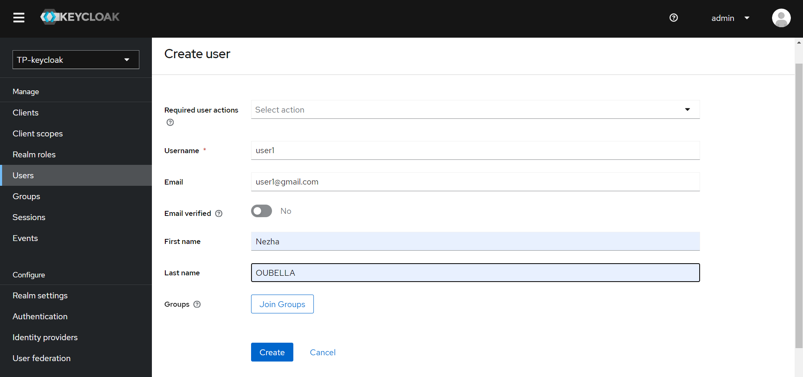

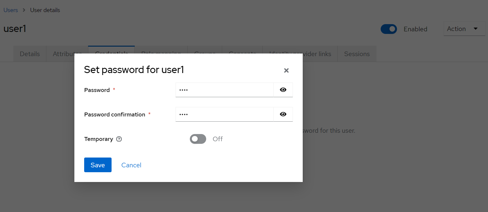

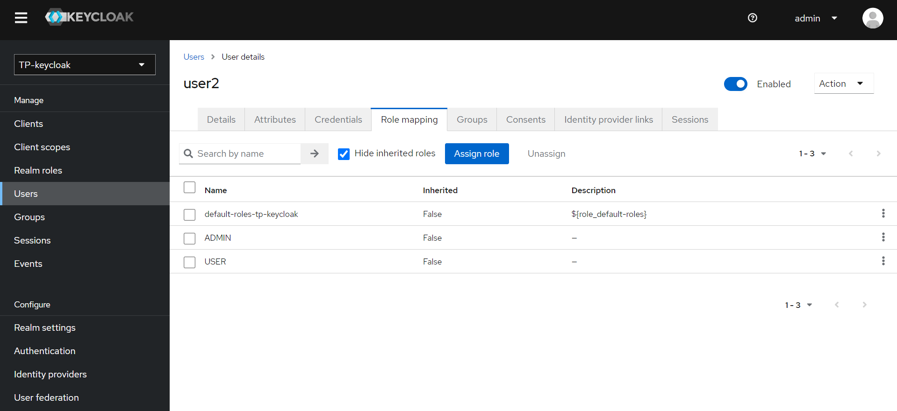

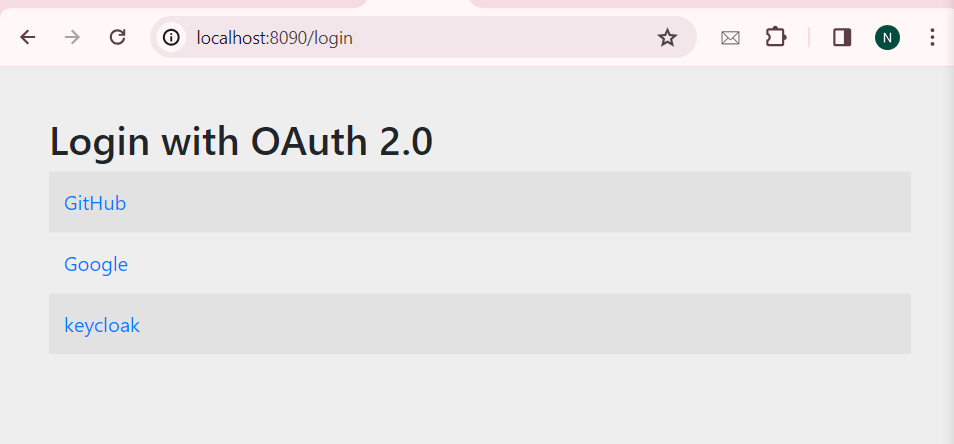

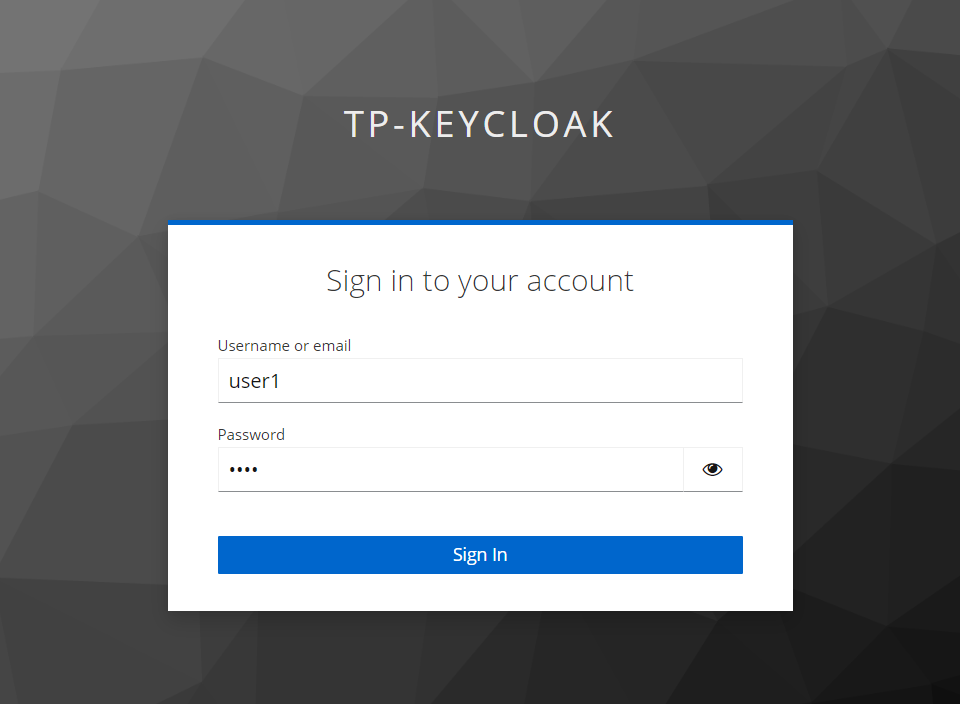

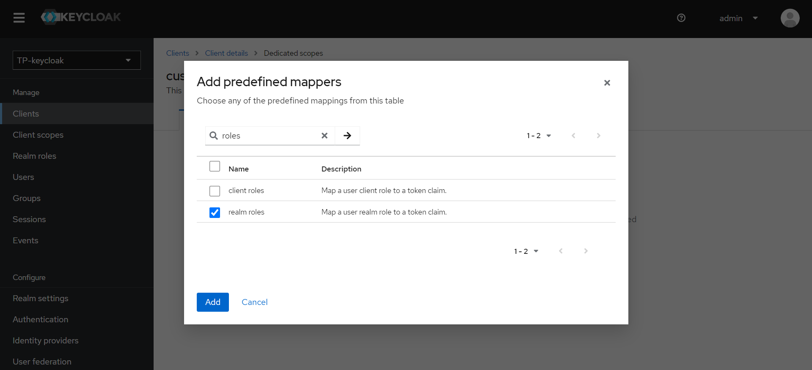

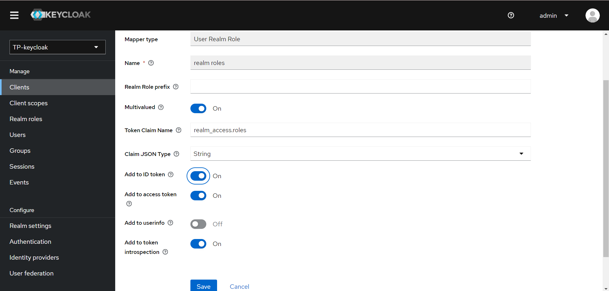

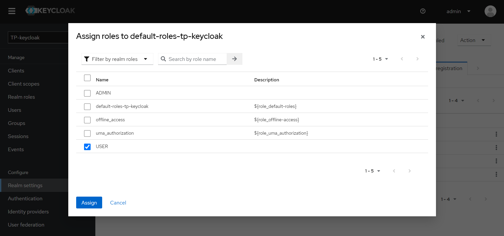

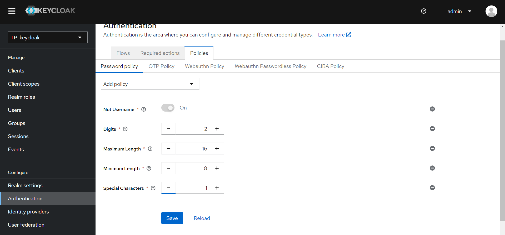

 

</ul>